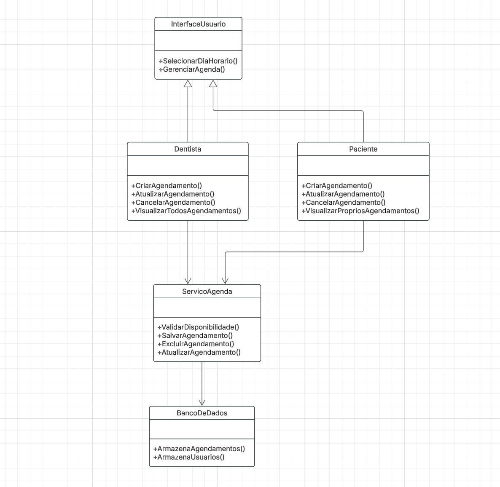
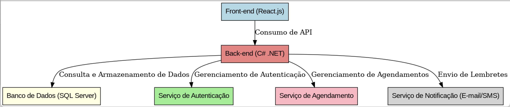
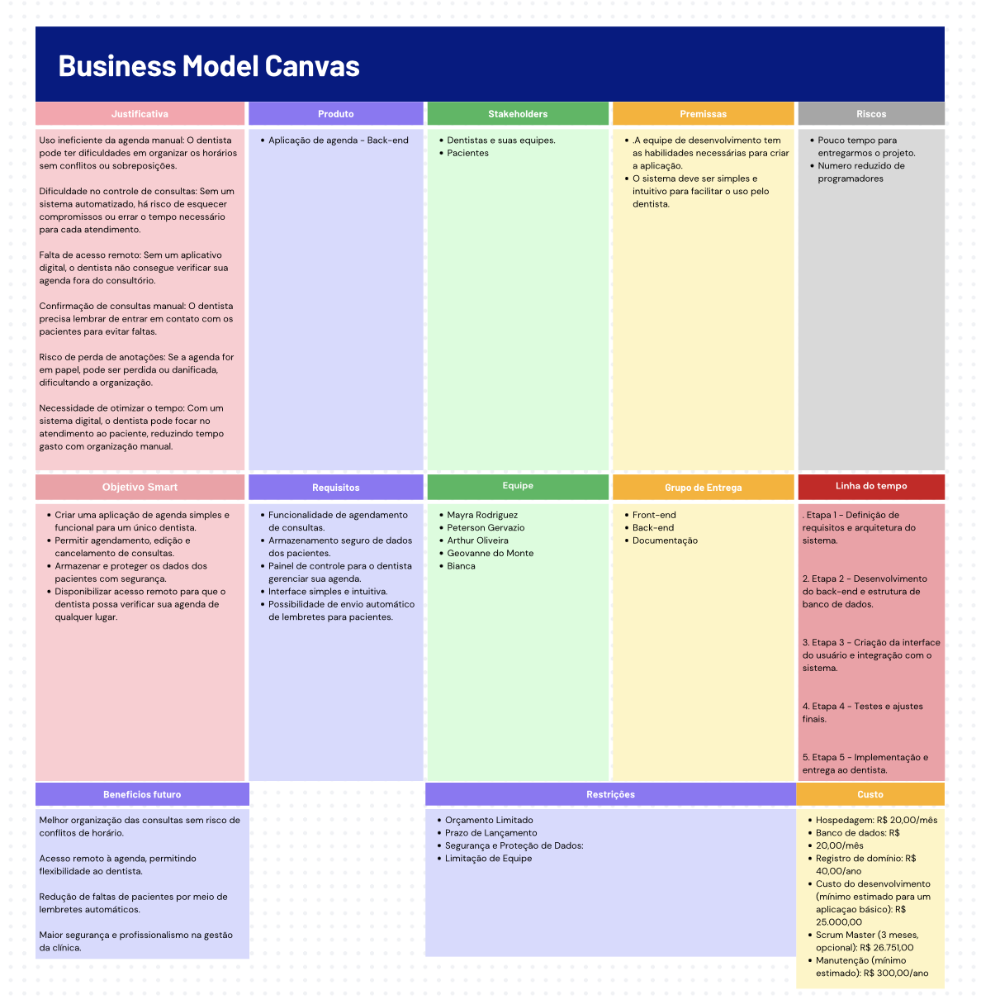
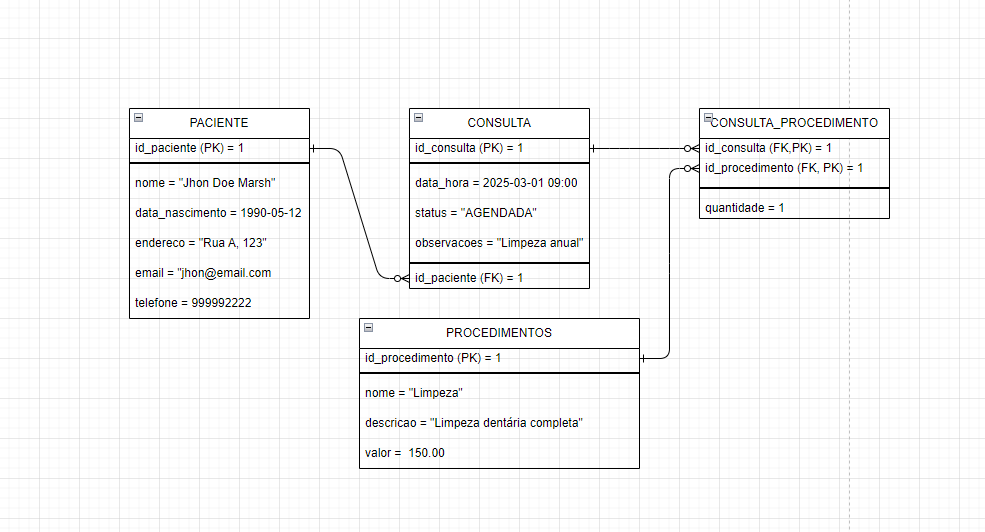

# Especificações do Projeto

<span style="color:red">Pré-requisitos: <a href="01-Documentação de Contexto.md"> Documentação de Contexto</a></span>

1. Visão Geral

O projeto consiste no desenvolvimento de uma aplicação web para gestão de agendamentos odontológicos, proporcionando automação no processo de marcação de consultas, envio de lembretes e organização da agenda do dentista.

2. Objetivos

Criar uma plataforma intuitiva para gerenciamento de consultas odontológicas.

Otimizar o tempo do dentista e sua equipe por meio da automação dos agendamentos.

Minimizar faltas de pacientes com envio automático de lembretes.

Proporcionar um sistema seguro e responsivo.

Definição do problema e ideia de solução a partir da perspectiva do usuário. 


| Tipo de Usuário   | Descrição | Responsabilidades |
|------------------|-----------|------------------|
| **Administrador** | Gerencia a aplicação e os usuários. | Gerenciar usuários, configurar o sistema, acessar todos as consultas. |
| **Funcionário** | Usa a aplicação para suas tarefas principais. | Criar e editar registros, visualizar consultas. |


## Arquitetura e Tecnologias

A aplicação será desenvolvida utilizando as seguintes tecnologias:

Back-end: C# com .NET Core

Front-end: React.js

Banco de Dados: SQL Server

Hospedagem: Azure ou Banco de dados uol.

Autenticação: Identity Server / JWT

Segurança: Criptografia de dados sensíveis e conformidade com a LGPD

Abaixo podemos visualizar o diagram de classe e um diagrama como será estruturado o site:

https://lucid.app/lucidchart/18d10723-7cfd-43ba-920d-3d321289639b/edit?viewport_loc=-1156%2C35%2C3279%2C1617%2C0_0&invitationId=inv_c01cf5f4-5710-44b1-ba23-af6431ad866e





## Project Model Canvas

https://www.canva.com/design/DAGf2pQd5S0/E1quqrSFAMirmc2RtQ2mAg/view?utm_content=DAGf2pQd5S0&utm_campaign=designshare&utm_medium=link2&utm_source=uniquelinks&utlId=h67e89b4645

> **Links Úteis**:
> Disponíveis em material de apoio do projeto

## Requisitos

| **ID** | **Requisito Funcionais**                      | **Prioridade** | **Descrição**                                                                                     |
|--------|-----------------------------------|----------------|-------------------------------------------------------------------------------------------------|
| RF-01 | Acesso rápido às informações de contato da clínica.| ALTA | Telefone, Endereço. |
| RF-02 | Consultar informações sobre a clínica e os profissionais.| ALTA| história, serviços oferecidos e casos clínicos. |
| RF-03 | Automação do agendamento de consultas online, permitindo que o cliente escolha horários disponíveis sem a necessidade de intervenção da recepção. | ALTA |   |
| RF-04 | Geração de relatório de agenda quinzenal com consultas agendadas e canceladas. | ALTA |  |
| RF-05 | Um painel administrativo simples para gerenciar os agendamentos. | ALTA |  |
| RF-06 | Envio de e-mail de confirmação para o cliente um ou dois dias antes de uma consulta. | ALTA | |
| RF-07 | Envio de e-mail para a recepção caso o cliente cancele a consulta. | ALTA | |
| RF-08 | Sistema de recuperação e alteração de senha. | MÉDIA | |
| RF-09 | Níveis de acesso e permissões| MÉDIA |  |
| RF-10 | Cadastro de pacientes| ALTA |  |
| RF-11 | Cadastro de dentistas / recepcionistas| BAIXA |  |


| **ID** | **Requisito Não Funcionais**                      | **Prioridade** | **Descrição**                                                                                     |
|--------|-----------------------------------|----------------|-------------------------------------------------------------------------------------------------|
| RF-01 | Lançamento de dados na agenda para garantir que o agendamento ocorra sem erros. | ALTA | |
| RF-02 | Conformidade com a LGPD para garantir a proteção de dados dos clientes.| ALTA | |
| RF-03 | Responsividade, para garantir acesso em dispositivos móveis e computadores.| ALTA | |
| RF-04 | O sistema deve estar disponível em horário comercial com um tempo de resposta inferior a 4 segundos.| ALTA | |
| RF-05 | O site deve estar disponível em Português e Inglês. | ALTA | |
| RF-06 | Usuários: Acesso somente ao site para visualizar informações. | MÉDIA |     |
| RF-06.1 | Clientes: Acesso somente ao site para visualizar informações e realizar agendamentos. | MÉDIA | |
| RF-06.2 | Administrador (Dono da Clínica): Acesso total ao painel administrativo, podendo visualizar, editar e cancelar agendamentos, além de gerenciar conteúdos do site. | ALTA | |
| RF-06.3 | Recepcionistas: Acesso ao painel administrativo para visualizar e gerenciar a agenda, sem permissão para editar conteúdos do site. | ALTA | |


| ID  | Restrição                                             |
|-----|-------------------------------------------------------|
| 01  | O projeto deverá ser entregue em Setembro |

## Diagrama de Caso de Uso


 

## Projeto da Base de Dados



## Modelo Físico
```
CREATE TABLE Pacientes (
    id_paciente INT AUTO_INCREMENT PRIMARY KEY,
    nome VARCHAR(100) NOT NULL,
    data_nascimento DATE NOT NULL,
    telefone VARCHAR(20) NOT NULL,
    email VARCHAR(100) UNIQUE,
    endereco TEXT
);

CREATE TABLE Consultas (
    id_consulta INT AUTO_INCREMENT PRIMARY KEY,
    id_paciente INT NOT NULL,
    data_hora DATETIME NOT NULL,
    status ENUM('AGENDADA', 'CONCLUIDA', 'CANCELADA') DEFAULT 'AGENDADA',
    observacoes TEXT,
    FOREIGN KEY (id_paciente) REFERENCES Pacientes(id_paciente)
);

CREATE TABLE Procedimentos (
    id_procedimento INT AUTO_INCREMENT PRIMARY KEY,
    nome VARCHAR(100) NOT NULL,
    descricao TEXT,
    valor DECIMAL(10,2) NOT NULL
);

CREATE TABLE Consulta_Procedimento (
    id_consulta INT NOT NULL,
    id_procedimento INT NOT NULL,
    quantidade INT DEFAULT 1,
    PRIMARY KEY (id_consulta, id_procedimento),
    FOREIGN KEY (id_consulta) REFERENCES Consultas(id_consulta),
    FOREIGN KEY (id_procedimento) REFERENCES Procedimentos(id_procedimento)
);

CREATE TABLE Pagamentos (
    id_pagamento INT AUTO_INCREMENT PRIMARY KEY,
    id_consulta INT NOT NULL,
    valor_pago DECIMAL(10,2) NOT NULL,
    data_pagamento DATE NOT NULL,
    forma_pagamento ENUM('Dinheiro', 'Cartão', 'Pix'),
    FOREIGN KEY (id_consulta) REFERENCES Consultas(id_consulta)
);
```

