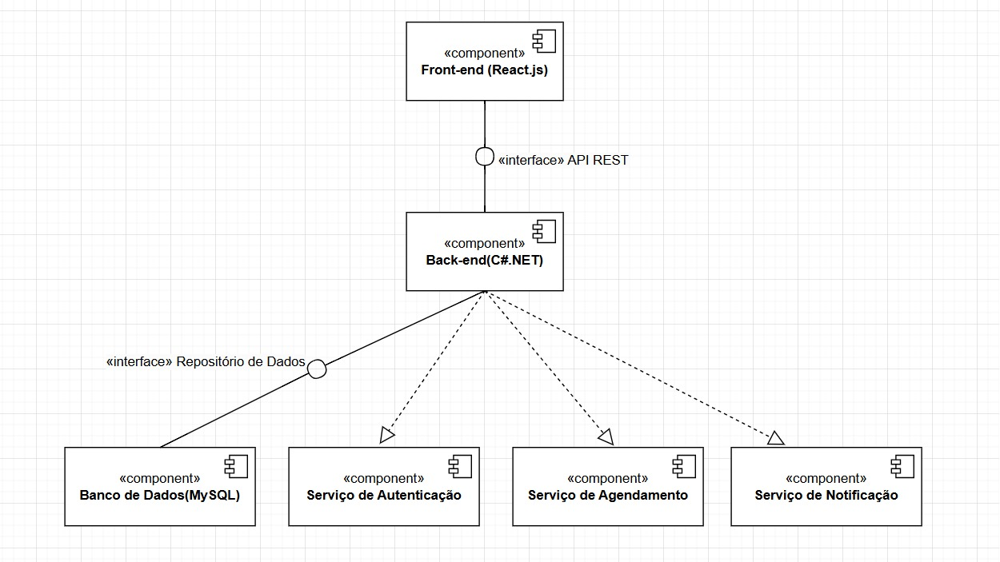
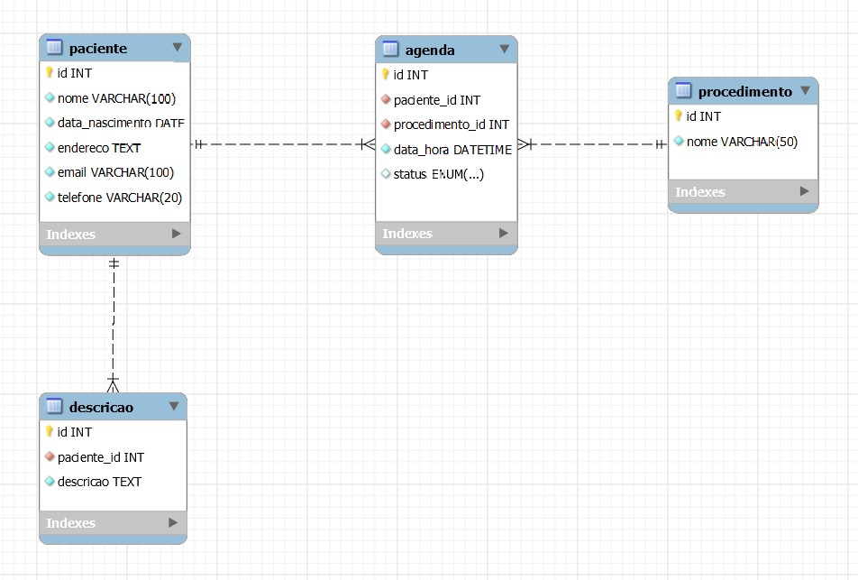

# Especificações do Projeto

<span style="color:red">Pré-requisitos: <a href="01-Documentação de Contexto.md"> Documentação de Contexto</a></span>

**1. Visão Geral**

O projeto consiste no desenvolvimento de uma aplicação web para gestão de agendamentos odontológicos, proporcionando automação no processo de marcação de consultas, envio de lembretes e organização da agenda do dentista.

**2. Objetivos**

Criar uma plataforma intuitiva para gerenciamento de consultas odontológicas.

Otimizar o tempo do dentista e sua equipe por meio da automação dos agendamentos.

Minimizar faltas de pacientes com envio automático de lembretes.

Proporcionar um sistema seguro e responsivo.

Definição do problema e ideia de solução a partir da perspectiva do usuário. 


| Tipo de Usuário   | Descrição | Responsabilidades |
|------------------|-----------|------------------|
| **Administrador** | Gerencia a aplicação e os usuários. | Gerenciar usuários, configurar o sistema, acessar todos as consultas. |
| **Paciente** | Usa a aplicação para suas tarefas principais. | Criar e editar registros, visualizar consultas. |


## Arquitetura e Tecnologias

A aplicação será desenvolvida utilizando as seguintes tecnologias:

Back-end: C# com .NET Core

Front-end: React.js

Banco de Dados: SQL Server

Hospedagem: Azure ou Banco de dados uol.

Autenticação: Identity Server / JWT

Segurança: Criptografia de dados sensíveis e conformidade com a LGPD

Abaixo podemos visualizar o diagram de classe e um diagrama como será estruturado o site:

https://lucid.app/lucidchart/18d10723-7cfd-43ba-920d-3d321289639b/edit?viewport_loc=-1156%2C35%2C3279%2C1617%2C0_0&invitationId=inv_c01cf5f4-5710-44b1-ba23-af6431ad866e




## Project Model Canvas

https://www.canva.com/design/DAGf2pQd5S0/E1quqrSFAMirmc2RtQ2mAg/view?utm_content=DAGf2pQd5S0&utm_campaign=designshare&utm_medium=link2&utm_source=uniquelinks&utlId=h67e89b4645

> **Links Úteis**:
> Disponíveis em material de apoio do projeto

## Requisitos

| **ID** | **Requisitos Funcionais**                      | **Prioridade** | **Descrição**                                                                                     |
|--------|-----------------------------------|----------------|-------------------------------------------------------------------------------------------------|
| RF-01 | Permitir que o usuário consulte informações sobre a clínica e os profissionais.| ALTA| história, serviços oferecidos e casos clínicos. |
| RF-02 | O cliente pode preencher o formulário de agendamento de consulta. | ALTA|  |
| RF-03 | Automatizar o agendamento de consultas online, permitindo que o cliente escolha horários disponíveis sem a necessidade de intervenção da recepção. | ALTA |   |
| RF-04 | Gerar relatórios quinzenais com consultas agendadas e canceladas. | ALTA |  |
| RF-05 | Enviar e-mail de confirmação para o cliente um ou dois dias antes de uma consulta. | ALTA | |
| RF-06 | O cliente pode enviar email de cancelamento da consulta para a recepção. | ALTA | |
| RF-07 | Enviar e-mail de confirmação de cancelamento para o cliente. | ALTA | |
| RF-08 | O administrador e o recepcionista pode realizar a recuperação e alteração de senha. | MÉDIA | |
| RF-09 | O administrador pode fazer o gerenciamento de usuários. | MÉDIA | Ler dados do usuário, editar e remover |
| RF-10 | O administrador e o recepcionista pode gerenciar o painel administrativo. | MÉDIA | visualizar, agendar e cancelar agendamentos |
| RF-11 | O administrador e o recepcionista pode gerenciar a agenda quinzenal. | MÉDIA | visualizar e gerar o relatório de agenda quinzenal.  |


| **ID** | **Requisitos Não Funcionais**                      | **Prioridade** | **Descrição**                                                                                     |
|--------|-----------------------------------|----------------|-------------------------------------------------------------------------------------------------|
| RF-01 | Lançamento de dados na agenda para garantir que o agendamento ocorra sem erros. | ALTA | |
| RF-02 | Conformidade com a LGPD para garantir a proteção de dados dos clientes.| ALTA | |
| RF-03 | Responsividade, para garantir acesso em dispositivos móveis e computadores.| ALTA | |
| RF-04 | O sistema deve estar disponível em horário comercial com um tempo de resposta inferior a 4 segundos.| ALTA | |
| RF-05 | O site deve estar disponível em Português e Inglês. | ALTA | |


| ID  | Restrição                                             |
|-----|-------------------------------------------------------|
| 01  | O projeto deverá ser entregue em Setembro |

## Diagrama de Caso de Uso


 

## Projeto da Base de Dados



## Modelo Físico
```
CREATE TABLE paciente (
    id INT AUTO_INCREMENT PRIMARY KEY,
    nome VARCHAR(100) NOT NULL,
    data_nascimento DATE NOT NULL,
    endereco TEXT NOT NULL,
    email VARCHAR(100) UNIQUE NOT NULL,
    telefone VARCHAR(20) NOT NULL
);

CREATE TABLE descricao (
    id INT AUTO_INCREMENT PRIMARY KEY,
    paciente_id INT NOT NULL,
    descricao TEXT NOT NULL,
    FOREIGN KEY (paciente_id) REFERENCES paciente(id) ON DELETE CASCADE
);

CREATE TABLE procedimento (
    id INT AUTO_INCREMENT PRIMARY KEY,
    nome VARCHAR(50) UNIQUE NOT NULL
);

CREATE TABLE agenda (
    id INT AUTO_INCREMENT PRIMARY KEY,
    paciente_id INT NOT NULL,
    procedimento_id INT NOT NULL,
    data_hora DATETIME NOT NULL,
    status ENUM('pendente', 'confirmado', 'cancelado') DEFAULT 'pendente',
    FOREIGN KEY (paciente_id) REFERENCES paciente(id) ON DELETE CASCADE,
    FOREIGN KEY (procedimento_id) REFERENCES procedimento(id) ON DELETE CASCADE
);
```

