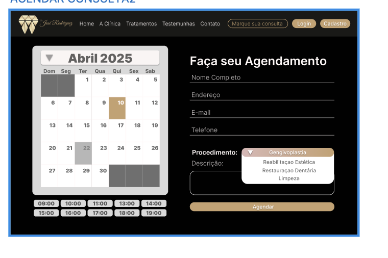
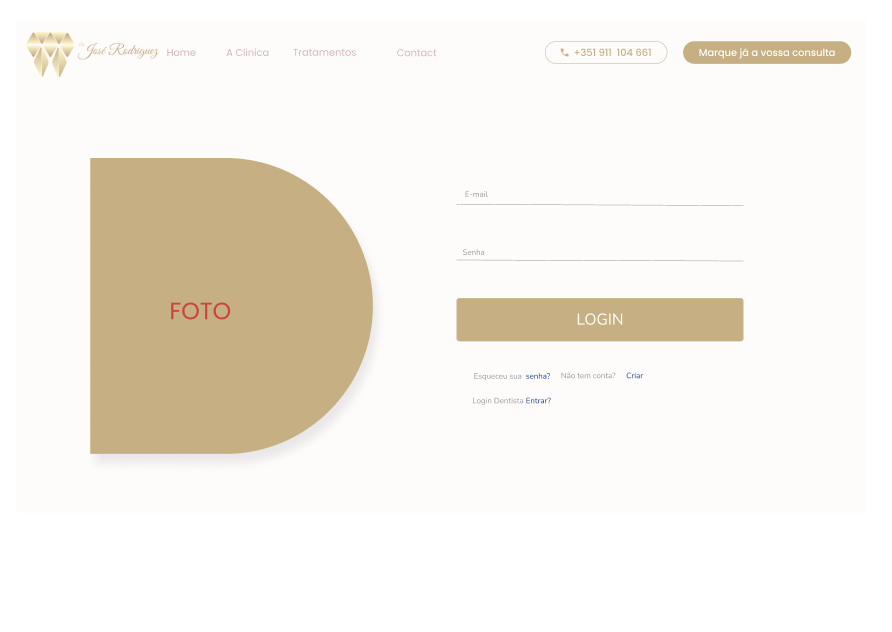
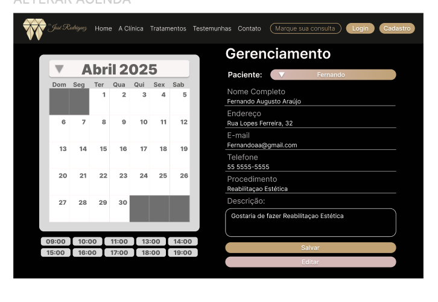
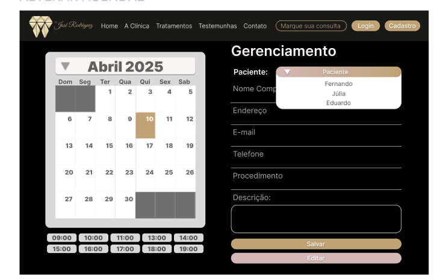

# Projeto de Interface

# Tela Home

Nessa Tela mostrará um video disponibilizado pelo dentista e especificações de tratamentos dentarios.

# tela antes e depois

O conteudo dessa tela será fotos de antes e depois 

# Historia

Já nessa pagina será abordado o percurso profissional do dentista.

# Depoimentos

Nessa parte terá depoimentos de pacientes do medico dentista.

# Localização 

Essa pagina mostrará a localizaçao da clinica

# Agendamento

Nesta página o paciente poderá realizar um agendamento.

# Login

  Essá pagina esta destinada para o Login de Dentistas e Recepcionistas.

# Gerenciamento do Painel Administrativo

Nesta parte os Dentistas e Recepcionistas poderão visualizar a agenda, alterar , adcionar e cancelar um agendamento.

