# 🦷 Projeto de Interface - Clínica Odontológica

Este projeto apresenta a interface de uma aplicação para uma clínica odontológica, com foco na experiência do paciente e no gerenciamento interno pelos profissionais da clínica. Desenvolvido utilizando o padrão **MVC com C#**, **HTML**, **JavaScript** e **Bootstrap**.

Abaixo pode-se ver o projeto interface interativo:

https://www.figma.com/design/NXXW3PXQyymDEvkNKzsuYo/Dr.-Jose-Rodriguez-(Copy)?t=wmKkhCENah7HoStj-1

---

## 📺 Tela Home

Nesta tela inicial, é exibido um **vídeo institucional** fornecido pelo dentista, além de **informações sobre os tratamentos odontológicos** oferecidos pela clínica.

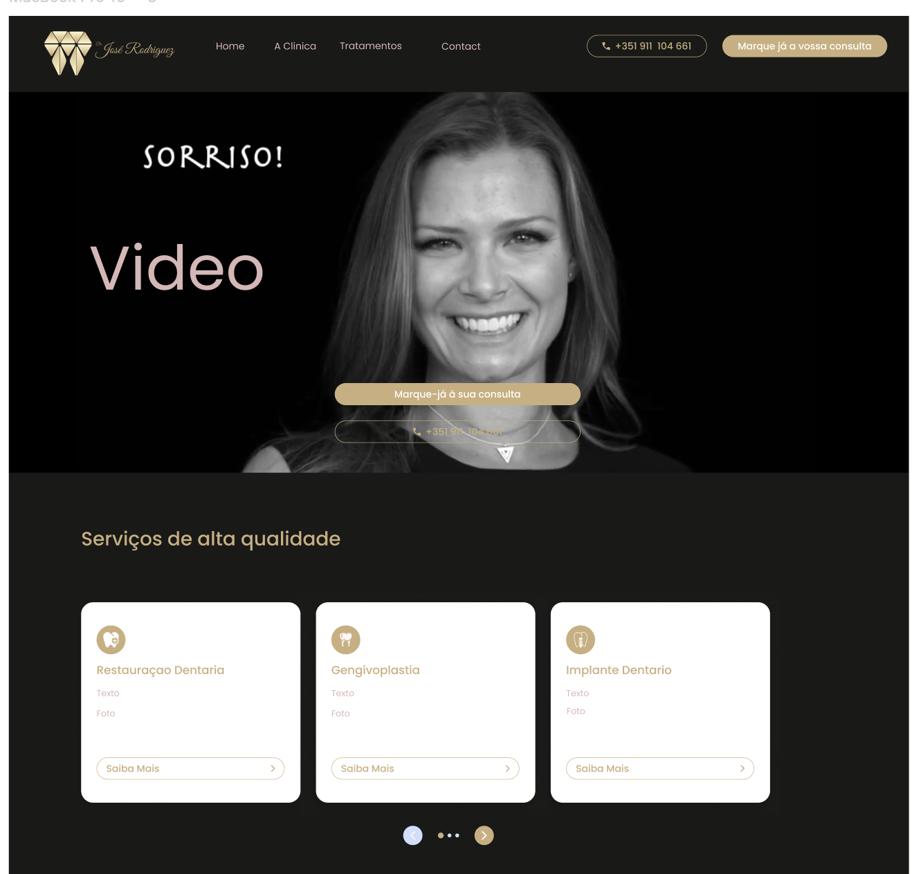

---

## 🖼️ Antes e Depois

A página "Antes e Depois" exibe imagens comparativas de pacientes **antes e após os tratamentos**, destacando os resultados alcançados pelos procedimentos odontológicos realizados.

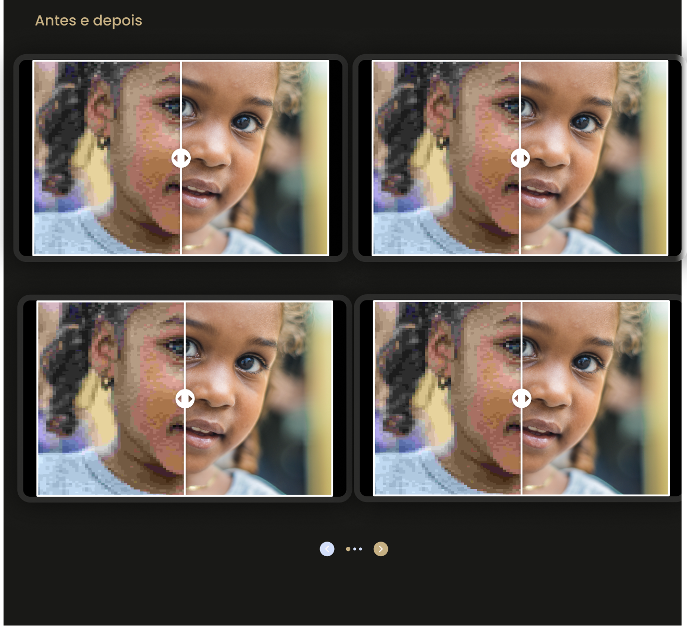

---

## 👨‍⚕️ História

Página que apresenta o **percurso profissional do dentista**, como sua formação, experiência clínica e especializações, fortalecendo a confiança dos pacientes.

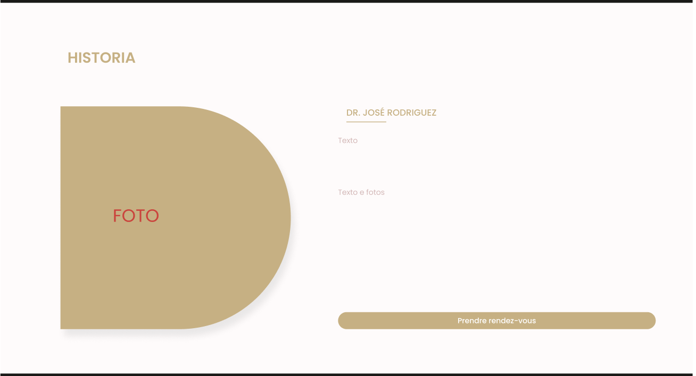

---

## 💬 Depoimentos

Sessão com **depoimentos reais de pacientes**, relatando suas experiências e satisfação com os serviços da clínica.

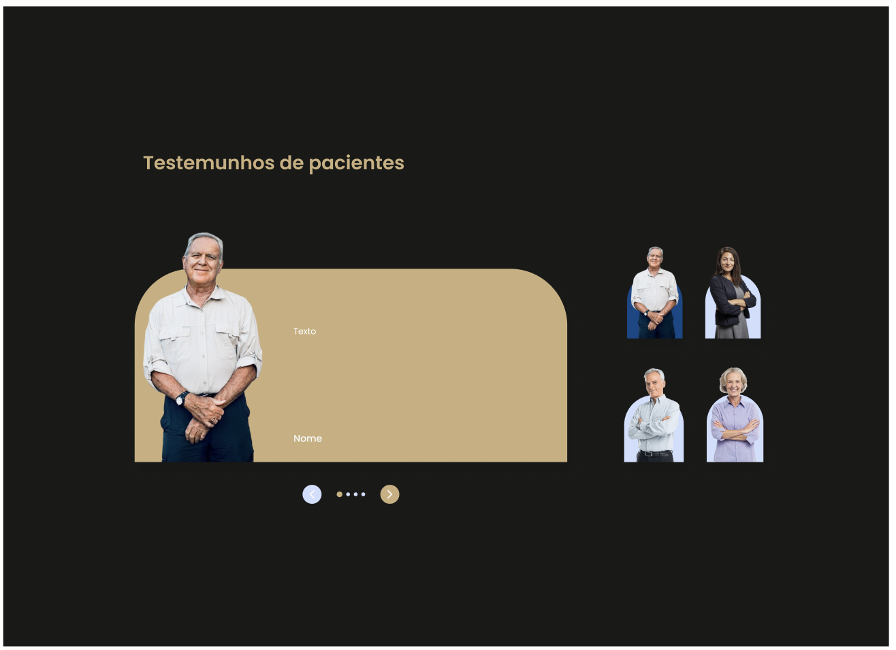

---

## 📍 Localização

Página com as **informações de localização da clínica**, incluindo mapa interativo, endereço completo e informações de contato para facilitar o acesso dos pacientes.

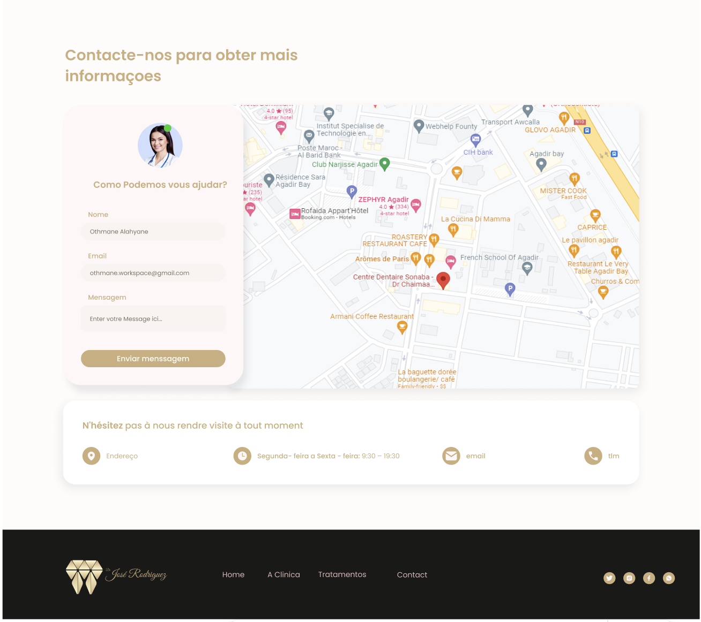

---

## 📅 Agendamento

Área onde o paciente pode **realizar seu agendamento online**, escolhendo o profissional, o tipo de tratamento, a data e o horário desejado.

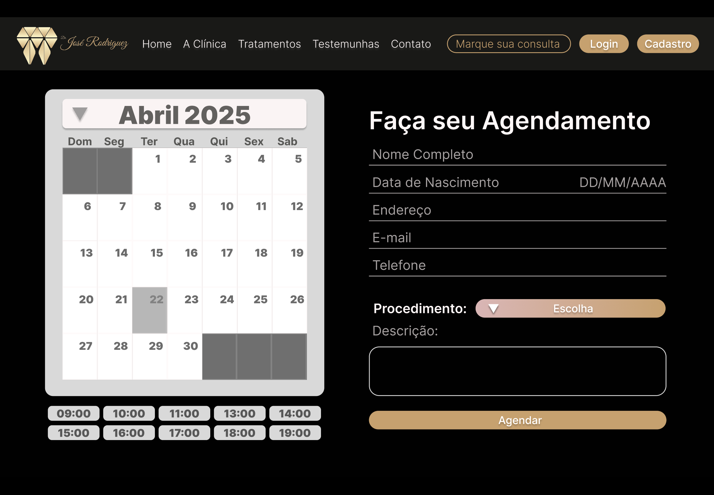

---

## 🔐 Login

Tela de **login restrito para dentistas e recepcionistas**. Após o login, o usuário tem acesso ao painel administrativo do sistema.

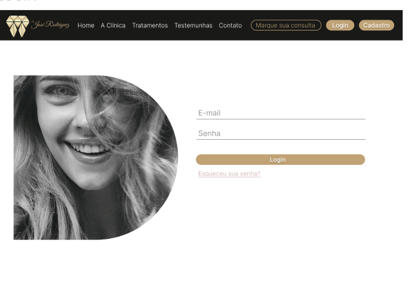

---

## ⚙️ Painel Administrativo

Funcionalidade acessível apenas para os profissionais da clínica, onde é possível:

- Visualizar a agenda de atendimentos
- Adicionar, editar ou cancelar agendamentos
- Atualizar os dados de cadastro
- Alterar a senha de acesso

### 📆 Gerenciamento da Agenda

Nesta seção, dentistas e recepcionistas podem **gerenciar todos os agendamentos** da clínica de forma prática e organizada.

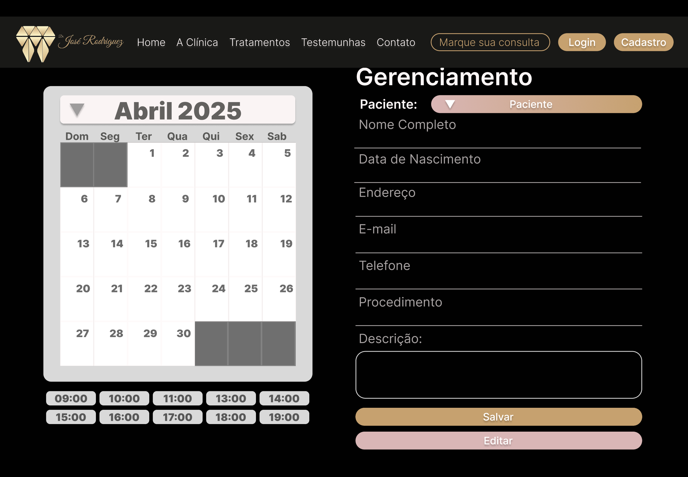  
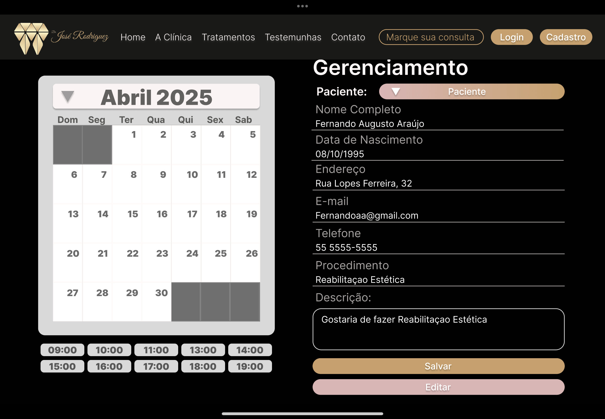 

---

### 👤 Alterar Cadastro do Dentista

Funcionalidade para **atualização de dados do profissional**, como nome, especialidade, e-mail e demais informações relevantes.

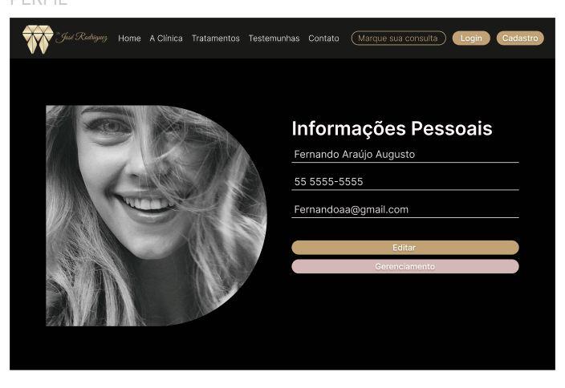

---

### 🔑 Alterar Senha

Tela destinada à **troca de senha** de acesso ao sistema, garantindo mais segurança e controle de acesso aos profissionais.

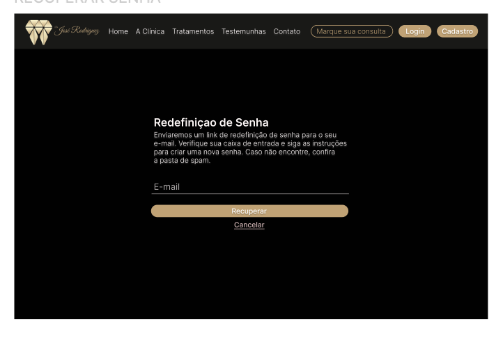

---

## 🛠️ Tecnologias Utilizadas

O projeto foi desenvolvido com as seguintes tecnologias:

- ASP.NET MVC (C#)
- HTML5
- CSS3
- JavaScript
- Bootstrap 5

---

